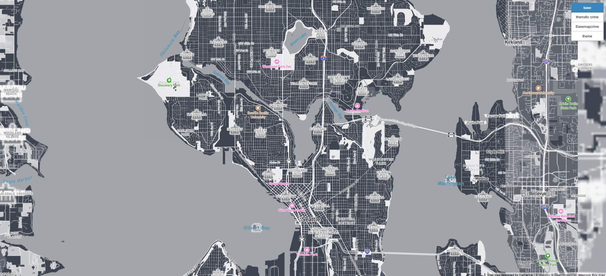
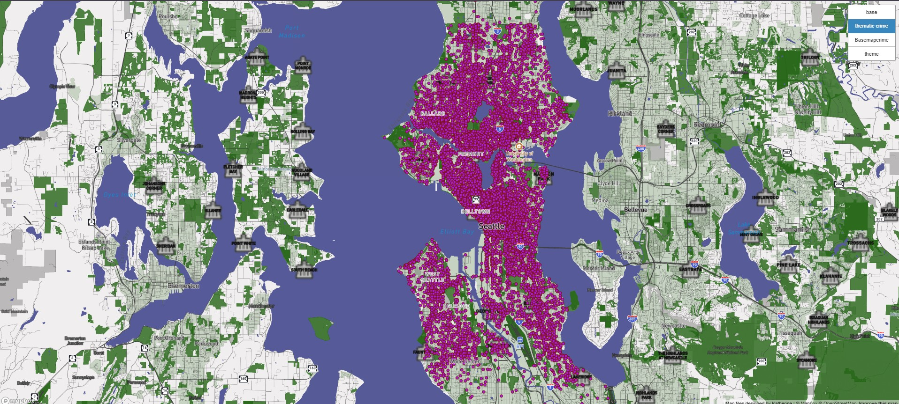
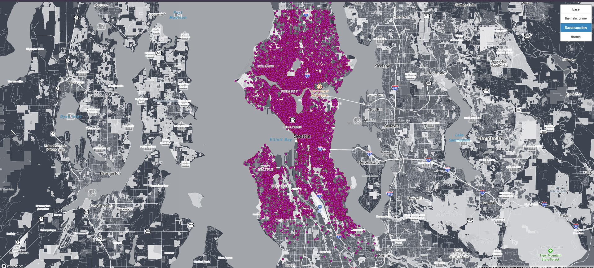
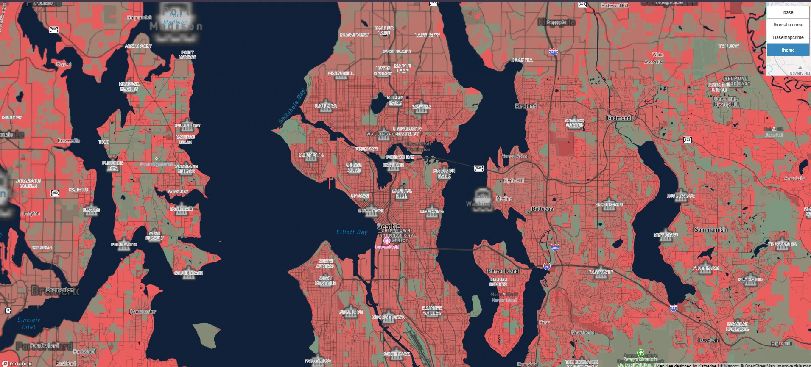

# Crime Data in Seattle from September 2025 - Feburary 2026
### Katherine Escoto Licona
[View Tileset Map](index.html)
## Summary
### For the tileset that I made I decided to look at the data from the City of Seattle portal named [SPD Crime Data: 2008-Present](https://data.seattle.gov/Public-Safety/SPD-Crime-Data-2008-Present/tazs-3rd5/about_data) due to it being from 2008- Present I desided to condense it into a much smaller dataset since it was way to large and would take alot of space on the map. This condesed the dataset completly making way more easier to manage. With this in mind I have 4 tileset maps that include the base map, the thematic crime map, crime data with basemap and lastly the crime theme. For each of the tilesets I ended up having 10 min- 15 max as zoom level.

## Tileset 1 - Basemap

### Explantation for Crime Basemap: For the first basemap I decided to do black and white to show a simple map that could be able to show off the data in more formatted way and that could be simple to understand with black and white colors.

## Tileset 2 - Thematic Map with Crime Data

### Explantation for thematic map: With thematic colors I decided to make to make the theme more brighter colors such as adding white and color coding the landscape of greenery and the water. The brigher colors of to be able to higlight the points of crime data in Seattle.

## Tileset 3- Basemap with Crime Data

### Exmplantion for Basemap with crime data: With this basemap and the crime we can see the larger

## Tileset 4- Public Safety Theme

### Explatation of Crime Theme: I decided to name this custom theme as crime theme since throughout my reasearch in looking at this crime data it relates to the topic of public safety as to why I name public safety theme to be able to highlight the important of public safety. Through the use of colors of red to help to alert users of warnings of publc saftey events fo when user use the map to add data to it to show the locations of where that alert happened.

